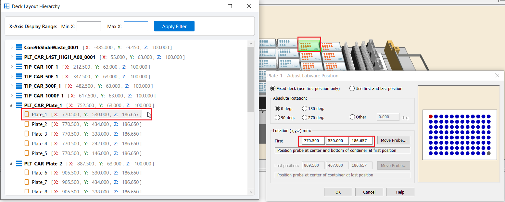

# VerisFlow.LayParser.Desktop

**VerisFlow.LayParser.Desktop is a high-performance WPF desktop application designed to parse Hamilton Venus deck layout files (`.lay`), visualize spatial labware hierarchies, and export structured layout reports.**

Target Frameworks: `.NET 8.0` | `.NET 9.0` | Windows Presentation Foundation (WPF)



---

## Overview

Hamilton Venus automation software relies on `.lay` deck layout files to define physical positions for carriers, racks, plates, and tip racks. `VerisFlow.LayParser.Desktop` provides automated parsing, spatial coordinate resolution, and graphical inspection for these layout files. It translates unmanaged layout structures into absolute 3D spatial coordinates ($X, Y, Z$) and provides real-time verification against actual physical deck positions in Hamilton Venus.

---

## Key Features

### Drag-and-Drop Layout Parsing
Users can drag a `.lay` file directly onto the main application window or choose a file via the standard file picker. The application processes the layout asynchronously off the UI thread to ensure zero UI freezing during heavy calculation tasks.

### Automated Markdown Report Generation
Upon parsing a deck layout file, the desktop tool automatically extracts labware dimensions, tip rack metadata, array bounds (rows/columns), and calculated final coordinates. It immediately generates a standalone, cleanly formatted `.md` report file alongside the original `.lay` file.

### Hierarchical Spatial Inspection
The integrated `DeckHierarchyWindow` groups labware under their parent carrier nodes in a tree structure. Each node displays high-precision $X, Y, Z$ coordinates with distinct color coding (Red for $X$, Green for $Y$, Blue for $Z$). Custom vector icons differentiate carriers from labware racks.

### Spatial Sorting and X-Axis Filtering
Carrier root nodes are sorted automatically along the $X$-axis from left to right, while child labware items on each carrier are ordered along the $Y$-axis descending. Developers and liquid handling engineers can specify Min $X$ and Max $X$ spatial bounds to isolate specific deck segments or deck tracks.

---

## Architecture & Data Flow

```text
+-----------------------------------------------------------------------+
|                             MainWindow                                |
|   (Custom Title Bar, Drag-and-Drop Area, DataGrid Data Visualizer)    |
+-----------------------------------+-----------------------------------+
                                    |
                                    v
+-----------------------------------+-----------------------------------+
|                     Background Processing Task                        |
|   (DeckLayoutParser -> LabwareDataProcessor -> Markdown Generator)    |
+-----------------------------------+-----------------------------------+
                                    |
                                    v
+-----------------------------------+-----------------------------------+
|                        DeckHierarchyWindow                            |
|  (Hierarchical TreeView, Coordinate Formatting, X-Axis Filter)        |
+-----------------------------------------------------------------------+

```

1. **File Ingestion**: `MainWindow` validates input files via `MainContent_Drop` or file pickers, allowing only valid `.lay` layout files.
2. **Asynchronous Parsing**: `ProcessDeckLayoutFile` offloads raw binary/text parsing (`DeckLayoutParser.GetLabwareInfo`) and position math (`LabwareDataProcessor.Process`) to thread pool tasks (`Task.Run`).
3. **Data Binding**: Results are loaded into an `ObservableCollection<ProcessedLabwareInfo>` bound to the primary `DataGrid`.
4. **Hierarchical Tree Construction**: `DeckHierarchyWindow` aggregates labware onto preceding carriers, builds node hierarchies, sorts by spatial axes, and applies display filters.

---

## Code Examples

### Asynchronous File Processing and Report Export

The snippet below demonstrates how `MainWindow` processes layout files on a background thread while preventing UI lockup and outputting an automated Markdown report.

```csharp
private async void ProcessDeckLayoutFile(string deckLayoutFile)
{
    StatusTextBlock.Text = $"Processing: {Path.GetFileName(deckLayoutFile)}...";
    SelectLayoutButton.IsEnabled = false;

    try
    {
        string markdownFilePath = Path.ChangeExtension(deckLayoutFile, ".md");

        // Run CPU and file-intensive parsing off the UI thread
        var processedData = await Task.Run(() =>
        {
            var raw = DeckLayoutParser.GetLabwareInfo(deckLayoutFile);
            var processed = LabwareDataProcessor.Process(raw);
            var markdown = GenerateMarkdown(deckLayoutFile, processed);

            File.WriteAllText(markdownFilePath, markdown);
            return processed;
        });

        // Update DataGrid binding on the main UI thread
        ProcessedLabwareData.Clear();
        foreach (var item in processedData)
        {
            ProcessedLabwareData.Add(item);
        }

        StatusTextBlock.Text = $"Displayed {processedData.Count} items and saved report to {markdownFilePath}.";
    }
    catch (Exception ex)
    {
        StatusTextBlock.Text = $"An error occurred: {ex.Message}";
        MessageBox.Show($"Error processing file: {ex.Message}", "Error", MessageBoxButton.OK, MessageBoxImage.Error);
    }
    finally
    {
        SelectLayoutButton.IsEnabled = true;
    }
}

```

### Hierarchy Building and Axis-Based Sorting

The snippet below illustrates how `DeckHierarchyWindow` assigns labware instances to their parent carriers and sorts child nodes by Y-coordinates and root carriers by X-coordinates.

```csharp
private void BuildHierarchy(double minX, double maxX)
{
    _treeNodes.Clear();
    HierarchyNodeViewModel currentCarrierNode = null;

    foreach (var item in _sourceData)
    {
        // Filter out items falling outside specified X bounds
        if (item.FinalX < minX || item.FinalX > maxX)
        {
            continue;
        }

        bool isCarrier = item.LabwareType == LabwareType.Carrier || item.LabwareType == LabwareType.RackCarrier;

        var node = new HierarchyNodeViewModel
        {
            IsCarrier = isCarrier,
            DisplayText = item.Id,
            FinalX = item.FinalX,
            FinalY = item.FinalY,
            FinalZ = item.FinalZ,
            FontWeight = isCarrier ? FontWeights.Bold : FontWeights.Normal
        };

        if (isCarrier)
        {
            currentCarrierNode = node;
            _treeNodes.Add(currentCarrierNode);
        }
        else
        {
            if (currentCarrierNode != null)
            {
                currentCarrierNode.Children.Add(node);
            }
            else
            {
                _treeNodes.Add(node);
            }
        }
    }

    // Sort labware on each carrier descending by Y coordinate
    foreach (var rootNode in _treeNodes)
    {
        if (rootNode.Children.Count > 1)
        {
            var sortedChildren = rootNode.Children.OrderByDescending(c => c.FinalY).ToList();
            rootNode.Children.Clear();
            foreach (var child in sortedChildren)
            {
                rootNode.Children.Add(child);
            }
        }
    }

    // Sort root carriers ascending by X coordinate
    if (_treeNodes.Count > 1)
    {
        var sortedRoots = _treeNodes.OrderBy(n => n.FinalX).ToList();
        _treeNodes.Clear();
        foreach (var root in sortedRoots)
        {
            _treeNodes.Add(root);
        }
    }
}

```

---

## Usage Guide

1. **Open a Layout File**: Click **Select Deck Layout File** or drag a `.lay` file into the main application window.
2. **Review Extracted Data**: Inspect the grid for item types, templates, grid dimensions (Column/Row), tip rack flags, and calculated $X, Y$ coordinates.
3. **Inspect Hierarchy**: Click **View Hierarchy** to open the `DeckHierarchyWindow`. Expand carrier nodes to inspect child labware.
4. **Filter Tracks**: Enter values in the **Min X** and **Max X** textboxes and click **Apply Filter** to narrow down the view to specific tracks on the deck.
5. **Access Report**: Locate the generated `.md` file in the same directory as the source `.lay` file for complete tabular documentation.

---

## Component Overview

`MainWindow.xaml` / `MainWindow.xaml.cs`
Main application UI containing the custom title bar, drag-and-drop dropzone, data grid, and background processing coordinator.

`DeckHierarchyWindow.xaml` / `DeckHierarchyWindow.xaml.cs`
Secondary inspection window rendering the carrier/labware tree view with X-axis filtering and vector iconography.

`HierarchyNodeViewModel`
Data model representation for hierarchical tree nodes bound to WPF `HierarchicalDataTemplate`.

---

## License

This project is licensed under the MIT License.
