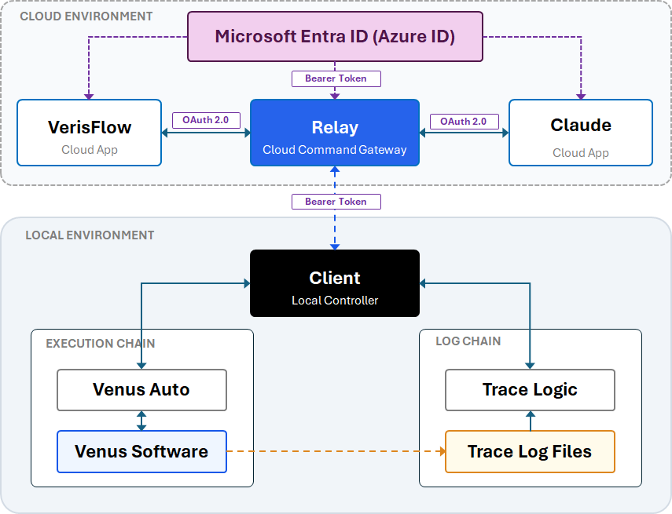

# VerisFlow.Mcp.Server.Sample

**VerisFlow.Mcp.Server.Sample is an ASP.NET Core Web API acting as a Model Context Protocol (MCP) Cloud Relay Gateway. It bridges Web AI assistants (such as Claude and ChatGPT) with local automation agents via SSE and SignalR.**

Target Frameworks: `.NET 8.0` | `.NET 9.0` | ASP.NET Core



---

## Overview

The Relay Server functions as a cloud gateway in the VerisFlow architecture. It exposes an OAuth-protected MCP Server interface over Server-Sent Events (SSE) and HTTP POST. When an AI client issues a tool execution request (such as parsing liquid handling traces or controlling Hamilton Venus hardware), the Relay Server correlates the request, translates it, and pushes it down to connected local WPF agents over an encrypted SignalR WebSocket link, bypassing local NAT and firewall boundaries.

---

## Key Features

### OAuth2 Proxy & Azure AD Authentication
Provides seamless OAuth authentication proxy endpoints (`/authorize` and `/token`) that automatically inject required Azure AD API scopes (`api://{ClientId}/access_as_user`) and sanitize requests against open-proxy vulnerabilities.

### MCP Gateway over SSE & JSON-RPC
Implements the Model Context Protocol (MCP) standard version `2024-11-05`. Supports `initialize`, `tools/list`, and `tools/call` methods over Server-Sent Events (`/mcp/sse`) and JSON-RPC HTTP POST endpoints (`/mcp/messages`).

### Asynchronous Request Correlation
Employs an in-memory `McpCoordinator` paired with `TaskCompletionSource<ToolResult>` instances. The server holds the incoming HTTP request open while delegating execution to the local agent, returning the response asynchronously once the agent completes execution.

### High-Throughput SignalR Relay Hub
Features an enlarged 10MB SignalR message payload ceiling (`/mcphub`) to support dense JSON trace analysis payloads and real-time execution status streams back to cloud clients.

---

## Architecture & Data Flow

1. **Client Authorization**: The Web AI authenticates against Microsoft Entra ID (Azure AD) or via the Server's OAuth proxy endpoints to receive a JWT Bearer token.
2. **SSE Connection**: The AI establishes a persistent SSE connection at `/mcp/sse` to receive real-time JSON-RPC notifications and session endpoints.
3. **Tool Invocation**: When the AI invokes a tool, `ClaudeMcpController.HandleMessage` parses the JSON-RPC request and registers a request correlation ID with `McpCoordinator`.
4. **SignalR Execution**: The server dispatches `ExecuteToolAsync` across `/mcphub` to the connected WPF desktop agent.
5. **Asynchronous Completion**: Upon tool completion, the WPF agent calls `SubmitToolResultAsync`, resolving the waiting `TaskCompletionSource` and flushing the JSON-RPC result back through the SSE response.

---

## Configuration

Update `appsettings.json` with your Azure AD application credentials:

```json
{
  "AzureAd": {
    "Instance": "[https://login.microsoftonline.com/](https://login.microsoftonline.com/)",
    "Domain": "yourtenant.onmicrosoft.com",
    "TenantId": "YOUR_AZURE_TENANT_ID",
    "ClientId": "YOUR_AZURE_CLIENT_ID",
    "Scopes": "access_as_user"
  },
  "Logging": {
    "LogLevel": {
      "Default": "Information",
      "Microsoft.AspNetCore": "Warning"
    }
  }
}

```

---

## Code Examples

### MCP Request Handling and SignalR Bridge

This snippet shows how incoming MCP `tools/call` JSON-RPC messages are mapped to local agents using asynchronous task correlation.

```csharp
else if (method == "tools/call")
{
    var paramsEl = request.GetProperty("params");
    var toolName = paramsEl.GetProperty("name").GetString();
    var argumentsJson = paramsEl.TryGetProperty("arguments", out var args) ? args.GetRawText() : "{}";

    // Map external MCP tool identifiers to internal agent endpoint names
    string targetToolName = toolName switch
    {
        "list_traces" => "list_trace_files",
        "parse_trace" => "parse_trace_details",
        _ => toolName!
    };

    var requestId = Guid.NewGuid().ToString("N");
    var tcs = new TaskCompletionSource<ToolResult>();
    _coordinator.Register(requestId, tcs);

    // Push command to WPF Agent via SignalR
    await _hubContext.Clients.All.ExecuteToolAsync(requestId, targetToolName, argumentsJson);

    // Await execution result pushed back from local agent
    var toolResult = await tcs.Task;

    var response = new
    {
        jsonrpc = "2.0",
        id = id,
        result = new
        {
            content = new object[] { new { type = "text", text = toolResult.Data } },
            isError = toolResult.IsError
        }
    };

    await _connectionManager.SendMessageAsync(sessionId, JsonSerializer.Serialize(response));
}

```

---

## API & Tool Endpoints Overview

`GET /authorize`
OAuth2 authorization redirect proxy. Injects Azure AD scope parameters automatically.

`POST /token`
OAuth2 token request proxy with form parameter sanitization.

`GET /mcp/sse`
MCP Server-Sent Events stream entry point. Requires `access_as_user` scope.

`POST /mcp/messages?sessionId={id}`
MCP JSON-RPC protocol message receiver.

`POST /api/tools/parse_trace`
Minimal API trigger for parsing liquid handling trace summaries.

`POST /api/tools/hamilton/action/{command}`
RESTful control route mapping actions (`start`, `pause`, `resume`, `abort`, `shutdown`) directly to hardware commands.

---

## License

This project is licensed under the MIT License.
