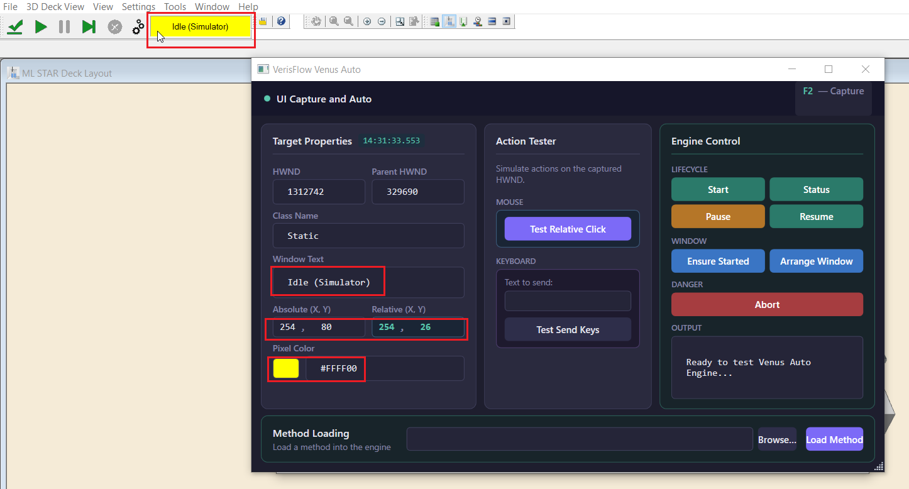

# VerisFlow.VenusAuto.Sample

**VerisFlow.VenusAuto.Sample is a WPF diagnostic application designed to demonstrate low-level Win32 UI probing, silent background action simulation, and integration with the VerisFlow Venus Automation Engine.**



---

## Overview

The sample application serves both as an interactive developer playground and a functional test harness for the `VerisFlow.VenusAuto.Core` automation library. By combining global Windows hotkey hooks with Win32 P/Invoke APIs, the application allows developers to inspect arbitrary UI elements on screen, calculate window-relative coordinates, test silent mouse and keyboard events, and issue run control operations directly to the Hamilton Venus engine.

---

## Key Features

### Global Hotkey UI Inspection
Pressing the global **F2** hotkey at any time captures details of the window element currently under the mouse cursor. The capture engine extracts native handles (HWND, Parent HWND), Win32 class names, window captions, screen-absolute coordinates, root-window-relative coordinates, and pixel RGB color values.

### Non-Intrusive Win32 Action Simulation
Provides real-time action testing capabilities. Developers can test background left-clicks on captured controls by constructing low-level `WM_LBUTTONDOWN` and `WM_LBUTTONUP` messages containing packed relative coordinates, as well as simulating function key triggers (such as `{F5}`) via `PostMessage` without capturing or freezing the physical mouse cursor.

### Venus Engine Lifecycle Integration
Integrates with `IVenusRunControlService` to test full lifecycle methods asynchronously. Features include process validation (`EnsureProcessStartedAsync`), execution status querying (`GetStatusAsync`), run control (`StartRunAsync`, `PauseRunAsync`, `ResumeRunAsync`, `AbortRunAsync`), window positioning (`ArrangeWindowAsync`), and file dialog method loading (`LoadMethodAsync`).

---

## Technical Architecture

The application adopts the MVVM (Model-View-ViewModel) design pattern, keeping UI layout strictly separated from native Win32 interactions and automation engine services.

```text
+-------------------------------------------------------------------+
|                           MainWindow                              |
|   (WPF Window, HwndSource Hook, Global F2 Hotkey Registration)    |
+---------------------------------+---------------------------------+
                                  |
                                  v
+---------------------------------+---------------------------------+
|                         MainViewModel                             |
|    (Coordinates UI Capture, Action Testing, and Engine Calls)     |
+-------------------+-----------------------------+-----------------+
                    |                             |
                    v                             v
+-------------------+---------+     +-------------+-----------------+
|      NativeMethods          |     |    IVenusRunControlService    |
| (Win32 P/Invoke Declarations|     |  (VerisFlow Automation Core)  |
|   User32.dll / Gdi32.dll)   |     +---------------------------------+
+-----------------------------+

```

1. **Global Hotkey Interception**: `MainWindow.xaml.cs` intercepts native messages before WPF dispatch by adding an `HwndSource` hook. When `WM_HOTKEY` matches the registered `HOTKEY_ID`, execution routes to the ViewModel.
2. **Coordinate & Surface Probe**: `MainViewModel.ExecuteCapture` utilizes `GetCursorPos` and `WindowFromPoint` to identify target window handles, traverses up the handle hierarchy via `GetAncestor(GA_ROOT)` to resolve the primary top-level window, and converts screen points to window-relative coordinates using `ScreenToClient`.
3. **Silent Action Posting**: `ExecuteTestClick` packs 16-bit relative X and Y coordinates into an `lParam` integer pointer `(y << 16) | (x & 0xFFFF)` and posts mouse down/up messages silently to the target HWND message queue.

---

## Code Examples

### Global Hotkey Setup in WPF Message Loop

The following snippet demonstrates how `MainWindow` registers the global `F2` key and hooks into the WPF message loop to receive unmanaged Windows messages.

```csharp
using System;
using System.Windows;
using System.Windows.Interop;
using VerisFlow.VenusAuto.Sample.Native;
using VerisFlow.VenusAuto.Sample.ViewModels;

namespace VerisFlow.VenusAuto.Sample
{
    public partial class MainWindow : Window
    {
        private const int HOTKEY_ID = 9000;
        private readonly MainViewModel _viewModel;

        public MainWindow(MainViewModel viewModel)
        {
            InitializeComponent();
            _viewModel = viewModel;
            DataContext = _viewModel;
        }

        protected override void OnSourceInitialized(EventArgs e)
        {
            base.OnSourceInitialized(e);

            var helper = new WindowInteropHelper(this);
            HwndSource source = HwndSource.FromHwnd(helper.Handle);
            source.AddHook(HwndHook);

            // Register global hotkey F2 without modifier keys
            NativeMethods.RegisterHotKey(helper.Handle, HOTKEY_ID, NativeMethods.MOD_NONE, NativeMethods.VK_F2);
        }

        protected override void OnClosed(EventArgs e)
        {
            var helper = new WindowInteropHelper(this);
            NativeMethods.UnregisterHotKey(helper.Handle, HOTKEY_ID);
            base.OnClosed(e);
        }

        private IntPtr HwndHook(IntPtr hwnd, int msg, IntPtr wParam, IntPtr lParam, ref bool handled)
        {
            if (msg == NativeMethods.WM_HOTKEY && wParam.ToInt32() == HOTKEY_ID)
            {
                _viewModel.ExecuteCapture();
                handled = true;
            }
            return IntPtr.Zero;
        }
    }
}

```

### Simulating Silent Clicks with Packed Relative Coordinates

This snippet illustrates how `MainViewModel` calculates relative window coordinates and constructs Win32 `lParam` parameters to perform silent mouse clicks.

```csharp
private void ExecuteTestClick(object? parameter)
{
    if (CurrentCapture == null || CurrentCapture.Hwnd == IntPtr.Zero) return;

    IntPtr hwnd = CurrentCapture.Hwnd;
    int x = CurrentCapture.RelativeX;
    int y = CurrentCapture.RelativeY;

    // Pack 16-bit X into low-order word and 16-bit Y into high-order word
    IntPtr lParam = (IntPtr)((y << 16) | (x & 0xFFFF));

    // Post mouse down followed by mouse up directly to the window message queue
    NativeMethods.PostMessage(hwnd, NativeMethods.WM_LBUTTONDOWN, (IntPtr)NativeMethods.MK_LBUTTON, lParam);
    NativeMethods.PostMessage(hwnd, NativeMethods.WM_LBUTTONUP, IntPtr.Zero, lParam);
}

```

---

## Usage Guide

1. **Launch the Application**: Build and run `VerisFlow.VenusAuto.Sample.exe`. The application window stays configured as `Topmost="True"` for easy access during UI probing.
2. **Inspect Target Controls**: Move the cursor over any interactive window or button on the screen (e.g., Hamilton Venus Run Control UI) and press **F2**. The application updates the **Target Properties** panel displaying the captured HWND, Class Name, Window Text, Relative Coordinates, and Pixel Color.
3. **Perform Action Tests**: Click **Test Relative Click** under the **Action Tester** panel to verify that the target window receives click events without shifting physical mouse focus.
4. **Test Engine Control**: Utilize the **Engine Control** panel to trigger real-time lifecycle methods (`Start`, `Status`, `Pause`, `Resume`, `Arrange Window`, `Abort`) against the underlying Venus application.
5. **Load Method File**: Click **Browse...** to pick a Hamilton Venus method (`.med` or `.hsl`) and execute **Load Method** to verify automated loading sequence workflows.

---

## Project Component Structure

`ViewModels/MainViewModel.cs`
Core ViewModel managing UI probing, coordinate conversion, Win32 action simulation, and integration command handlers.

`Models/CaptureSnapshot.cs`
Data model holding UI element properties captured at a given timestamp.

`Native/NativeMethods.cs`
Static class wrapping User32 and GDI32 unmanaged P/Invoke methods, constants, and structures.

`MainWindow.xaml` / `MainWindow.xaml.cs`
Dark-themed XAML interface and code-behind handling window lifecycle and message hooks.

---

## License

This project is licensed under the MIT License.
